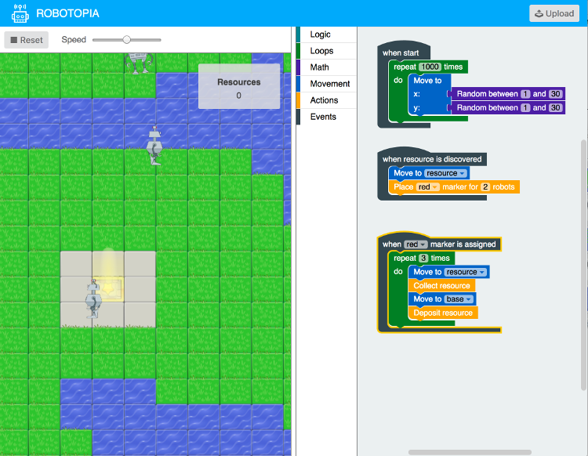

# Robotopia :robot:

[](https://github.com/yoshuawuyts/choo)
[](https://github.com/robotopia-x/robotopia/blob/master/LICENSE)

> Robotopia is an in-browser learning tool for kids and young adults. It strives to teach programming concepts together with basic logic in a fun and comforting way without writing a single line of code.



## Features

- [x] Teaches kids to code
- [x] Features cute graphical robots which want to be programmed
- [x] Introduction tutorials and open world mode for long lasting fun
- [x] Learn basic coding logic 
  - [x] Conditions
  - [x] Loops
  - [x] Events
  - [x] Basic arithmetic logic
- [x] Runs in your browser tab
- [x] Works with Google Chrome
- [x] No download required
- [x] Uses the battle-tested Google Blockly graphical programming language
- [x] Multiplayer experience
- [x] User tested
- [x] Peer-to-Peer Connection between clients and presenter
- [x] Uses the [Choo](https://github.com/yoshuawuyts/choo) JS-Framework 
- [x] *Easy self-hosting*.

## How *You* could use this
If you're interested in using our tool in an event in your area, feel free to do so.  
**Here's a little guide to get you started**.

### What you'll need
- A small room for the event
- Around 1,5h of time
- Computers/Laptops with Chrome installed
- A projector
- Some kids or youths
- Yourself and, depending on the amount of kids, maybe a friend or two

### Agenda
**1. Introducing the kids with the tutorials**


On the computers open Chrome and head over to https://robotopia-x.github.io. Here the kids first will play through the tutorials.  While they are learning the basic concepts, you and your friends meanwhile help them understand these concepts.  
At the time of reaching the end of the tutorials, you can open the presenter on the mentioned projector.    
Head over to http://robotopia-x.github.io/#presenter and enter a name for your room. (That's the room name the kids have to enter later)
> Note: We had the impression, that 1 supervisor can handle ~5 kids.

**2. Building a basic competitive program**


At this point, the supervisors will, together with the him assigned kids, build a competitive program.  
He'll show them the basic idea behind the program and make them ready to build their own.
Upload the current code by pressing the "Upload" button on the top right corner.
> Note: You'll run the first competitive game with 2 of the build programs

**3. Let the robots battle**


You now have to get back to the presenter on the projector. Press the "Run" button and select two players that already commited their program.  
You can now press the "Start" button to start the competition.  
> Note: The idea on this point is, that all people in the room now look at the game running on the projector.

**4. Improving the programs**


When the first few competitions are finished, the kids get time to imporove their programs with things they noticed while battling.    
Also, the kids that could't build their own program by now get the time and opportunity to commit their own program and compete with the others.
> Note: This part of the event can be extended as long as the kids are interested. 

## Installation
> Make sure to use Google Chrome

*You can find the most recent version here: [Robotopia](https://robotopia-x.github.io)*

```bash
git clone https://github.com/robotopia-x/robotopia.git
cd robotopia
npm install
npm start
```
A local webserver will be started at [http://localhost:9966/](http://localhost:9966/).

## Related
- [Our research repo](https://github.com/robotopia-x/research)
- [Our presentation slides](http://slides.com/pguth/robotopia-x)
